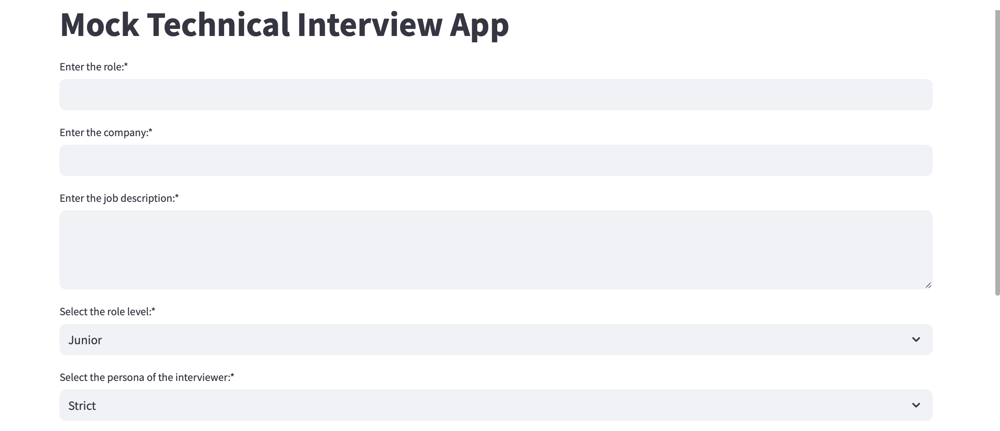
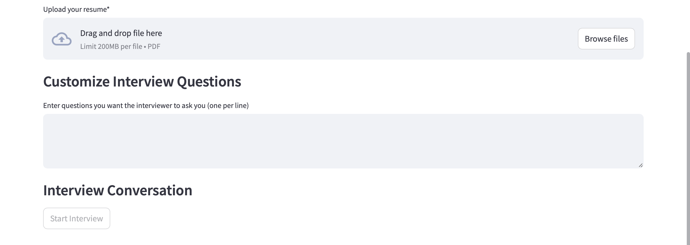

# Technical Interview Practice App

This project is a Streamlit-based web application designed to help people prepare for technical interviews. The app uses OpenAI's 'gpt-4o-mini' model to conduct the interview and 'whisper-1' model to transcribe audio responses.

## Features

- **Role-Specific Interviews**: Customize the interview based on the role, company, and job description.
- **Persona Selection**: Choose the interviewer's persona (Strict, Neutral, Friendly) to simulate different interview styles.
- **Resume Analysis**: Upload your resume in PDF format for the AI to analyze and tailor the interview questions.
- **Custom Questions**: Add your own questions that you want to be asked during the interview.
- **Audio Transcription**: Record and transcribe your responses using OpenAI's Whisper model.
- **Security**: Detects and prevents prompt injection attacks to ensure a safe interview environment.

The application was successfully deployed to Streamlit Cloud. To interact, you can follow this [link](https://interviewpracticeapp-33kh8ujwtju8kpe2uwptbv.streamlit.app).


## Tech Stack

- **Frontend:** Streamlit  
- **AI Models:** OpenAI's `gpt-4o-mini` (interviews), `whisper-1` (transcriptions)  
- **Backend:** Python  
- **Security Measures:** 
    * Regular Expression (Regex) Filtering
    * AI-Based Validation with GPT

## Screenshots




## Installation

To run the app locally, follow these steps:

1. Clone the repository:
    ```sh
    git clone git@github.com:Andriy852/InterviewPracticeApp.git
    cd InterviewPracticeApp
    ```

2. Install Poetry (if you don't have it installed yet):
    ```sh
    curl -sSL https://install.python-poetry.org | python3 -
    ```
3. Install the required dependencies:
    ```sh
    poetry install

    ```
4. Activate the virtual environment:
    ```sh
    poetry env activate
    ```
5. Get Your OpenAI API Key and set it in your environment:
    ```sh
    export OPENAI_API_KEY="your-api-key-here"
    ```
6. Run the Streamlit app:
    ```sh
    streamlit run tech_interview_app.py
    ```
